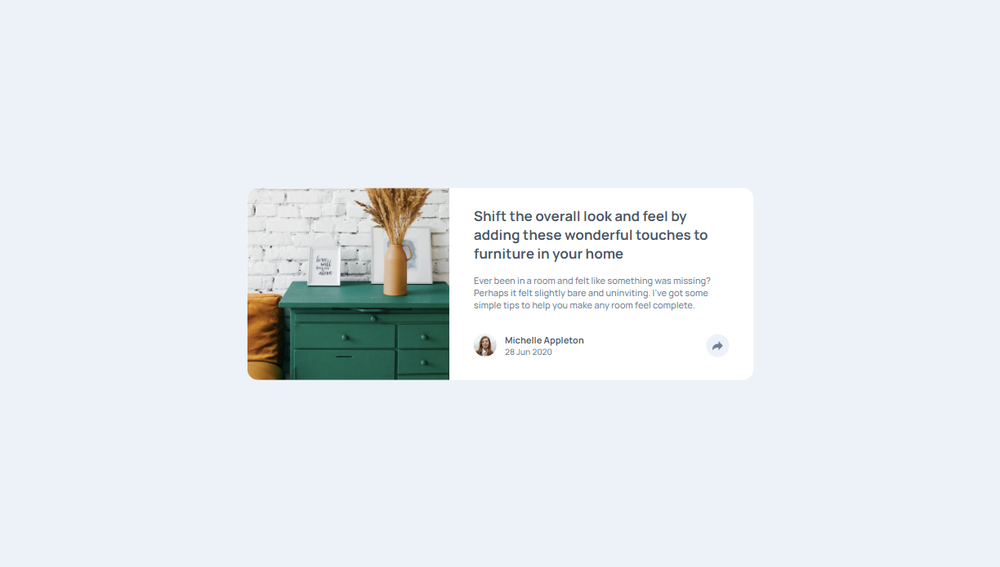
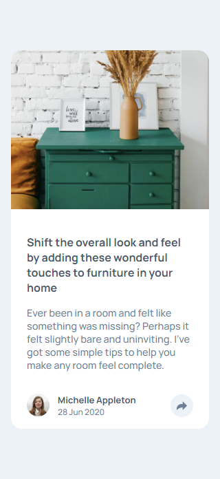
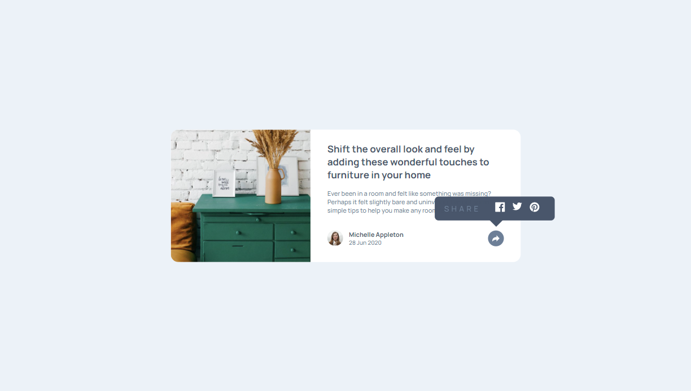
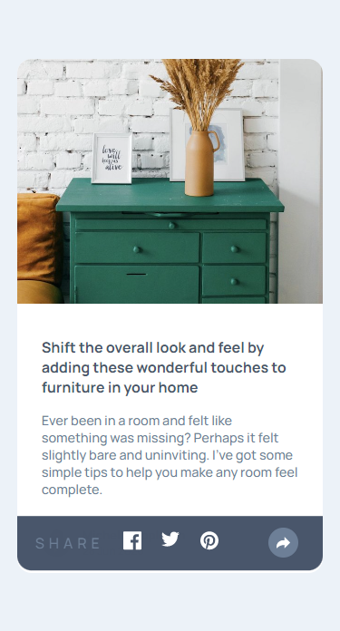

# Article Preview Component with Fade-In Animation - React

This is my solution for the Article Preview Component challenge from Frontend Mentor with an added fade-in animation effect. The challenge was to create a responsive article preview component that displays an article image, title, author, and publishing date. Additionally, the component should have a share button that displays social media icons on click, and the social media icons should have a fade-in animation effect.

## Table of Contents

- [Overview](#overview)
    - [Screenshot](#screenshot)
    - [Links](#links)
- [Features](#features)
- [Technologies](#technologies)
- [Setup](#setup)
- [Usage](#usage)
- [Acknowledgements](#acknowledgements)
- [Credits](#credits)

## Overview

This is a README file for a project that includes an Article Preview Component developed with React and an added fade-in animation effect. The article preview component is responsive and displays an article image, title, author, and publishing date. The component also has a share button that displays social media icons on click, and the social media icons have a fade-in animation effect.

### Screenshot

|  |  |
| ------------------------------ | ----------------------------- |
| Desktop version                | Mobile version                |

|  |  |
| ------------------------------ | ----------------------------- |
| Desktop version                | Mobile version                |

### Links

- [Live Demo](https://hatemhenchir.github.io/article-preview-component-master/)
- [Repository](https://github.com/hatemhenchir/article-preview-component-master/)

## Features

The features of this project are as follows:

- Displays article image, title, author, and publishing date
- Share button that displays social media icons on click
- Social media icons with fade-in animation effect
- Responsive design for desktop and mobile

## Technologies

The technologies used in this project are as follows:

- React
- HTML
- CSS
- JavaScript

## Setup

To set up this project, follow the steps below:

1. Clone the repository: `git clone https://github.com/your-username/article-preview-component-master.git`
2. Install dependencies: `npm install`
3. Start the development server: `npm start`
4. Open the application in your browser at `http://localhost:3000`

## Usage

To use this project, follow the steps below:

1. Open the application in your browser at `http://localhost:3000`
2. Click on the share button to display the social media icons with a fade-in animation effect
3. Click on any social media icon to share the article
4. Scroll down the page to view the fade-in animation effect on the article preview components

## Acknowledgements

This project was developed with reference to the following resources:

- [Frontend Mentor](https://www.frontendmentor.io/challenges/article-preview-component-dYBN_pYFT) for providing the challenge
- [React documentation](https://reactjs.org/docs/getting-started.html) for reference and guidance

## Credits

- My LinkedIn: [@hatem-henchir-7a92141a8](https://www.linkedin.com/in/hatem-henchir-7a92141a8/)
- My Frontend Mentor: [@hatemhenchir](https://www.frontendmentor.io/profile/hatemhenchir)
